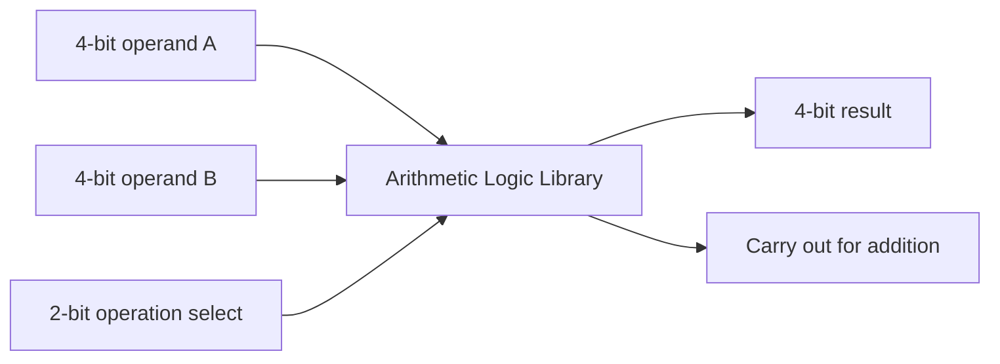

# RTL block diagram

```mermaid
flowchart LR
  A[4-bit operand A] --> U[Arithmetic Logic Library]
  B[4-bit operand B] --> U
  S[2-bit operation select] --> U
  U --> R[4-bit result]
  U --> C[Carry out for addition]
```

The selector chooses bitwise AND (`00`), OR (`01`), XOR (`10`), or unsigned addition (`11`).
