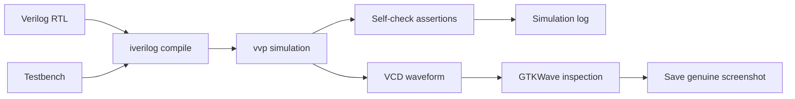

# Simulation workflow

```mermaid
flowchart LR
  RTL[Verilog RTL] --> COMPILE[iverilog compile]
  TB[Testbench] --> COMPILE
  COMPILE --> RUN[vvp simulation]
  RUN --> CHECK[Self-check assertions]
  RUN --> VCD[VCD waveform]
  CHECK --> LOG[Simulation log]
  VCD --> GTK[GTKWave inspection]
  GTK --> SHOT[Save genuine screenshot]
```
